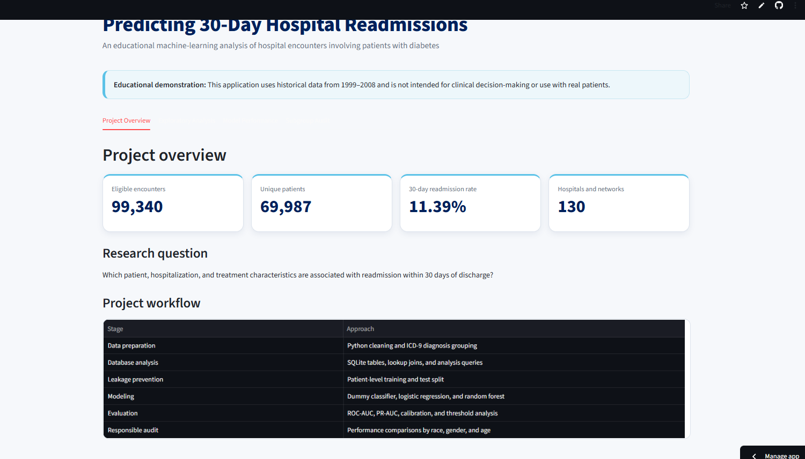

# Predicting 30-Day Hospital Readmissions

An end-to-end healthcare machine-learning project examining which patient, hospitalization, and treatment characteristics are associated with readmission within 30 days of discharge among hospital encounters involving patients with diabetes.

## Live Application

[Explore the interactive Streamlit application](https://adanya-hospital-readmission.streamlit.app/)



## Project Overview

Hospital readmission is an important healthcare outcome because it may reflect patients’ health needs, continuity of care, discharge planning, and access to follow-up services.

This project uses historical hospital-encounter data to answer:

> Which patient, hospitalization, and treatment characteristics are associated with readmission within 30 days of discharge?

The project demonstrates a complete healthcare analytics workflow using SQL, Python, machine learning, interactive visualization, and responsible model evaluation.

This is an educational portfolio project and is not intended for clinical decision-making or use with real patients.

## Dataset

The project uses the [Diabetes 130-US Hospitals for Years 1999–2008 dataset](https://archive.ics.uci.edu/dataset/296/diabetes+130+us+hospitals+for+years+1999+2008) from the UCI Machine Learning Repository.

The original dataset contains:

- 101,766 hospital encounters
- 71,518 patients before project exclusions
- Records from 130 U.S. hospitals and integrated delivery networks
- Patient demographics
- Hospital admission and discharge information
- Diagnoses
- Laboratory testing
- Medication information
- Previous inpatient, outpatient, and emergency utilization

The project outcome was defined as:

| Original value | Project outcome |
|---|---|
| `<30` | Readmitted within 30 days (`1`) |
| `>30` | Not readmitted within 30 days (`0`) |
| `NO` | Not readmitted within 30 days (`0`) |

After cleaning and eligibility exclusions, the analysis contained:

- **99,340 eligible encounters**
- **69,987 unique patients**
- **11.39% 30-day readmission rate**

## Tools and Skills

- **Python:** Data cleaning, feature engineering, analysis, and modeling
- **pandas and NumPy:** Data manipulation
- **SQLite and SQL:** Database creation, lookup joins, and analytical queries
- **scikit-learn:** Preprocessing pipelines and machine learning
- **Matplotlib, Seaborn, and Plotly:** Static and interactive visualization
- **Streamlit:** Interactive results application
- **Git and GitHub:** Version control and reproducibility
- **Jupyter:** Documented exploratory and modeling workflows

## Data Preparation

The reproducible cleaning pipeline:

1. Converted `?` entries into standard missing values.
2. Checked for exact duplicate records and duplicate encounter IDs.
3. Removed three records with `Unknown/Invalid` gender.
4. Removed 2,423 encounters ending in death or hospice care.
5. Removed `weight`, `payer_code`, and `medical_specialty` from the modeling file because of substantial missingness and limited baseline utility.
6. Decoded admission type, discharge disposition, and admission source identifiers.
7. Grouped sparse ICD-9 diagnosis codes into broader clinical categories.
8. Created the binary `readmitted_30d` outcome.
9. Preserved repeated patient encounters for leakage-safe patient-level splitting.

A complete record of the exclusions is available in [`cleaning_audit.csv`](reports/tables/cleaning_audit.csv). Variable definitions and modeling decisions are documented in [`data_dictionary.md`](data_dictionary.md).

## SQL Analysis

The project creates a local SQLite database containing:

- An `encounters` table
- Admission-type lookup table
- Discharge-disposition lookup table
- Admission-source lookup table
- An `encounter_details` view joining encounters to readable descriptions
- Indexes for encounter, patient, and outcome fields

The SQL analysis examines readmission by:

- Age
- Race
- Gender
- Admission type
- Time in the hospital
- Previous inpatient utilization
- HbA1c testing
- Medication changes
- Diabetes-medication use

See [`02_analysis_queries.sql`](sql/02_analysis_queries.sql) for the complete queries.

## Exploratory Findings

### Previous hospital utilization

Previous inpatient utilization showed the strongest descriptive relationship with the outcome.

Encounters involving patients with **three or more inpatient visits during the preceding year** had a **26.4% 30-day readmission rate**, compared with an overall rate of 11.39%.

### Age

Among age groups containing at least 500 encounters, patients ages **20–29** had the highest observed readmission rate at **14.31%**.

### Primary diagnosis

Encounters with a primary diagnosis categorized as **diabetes** had the highest diagnosis-group readmission rate at **13.1%**.

### Admission type

Emergency admissions had the highest observed rate among admission-type categories containing at least 500 encounters, at **11.83%**.

These are unadjusted descriptive associations and do not establish causation.

## Leakage Prevention

The dataset contains multiple encounters for some patients. A random encounter-level split could place records belonging to the same patient in both the training and test sets.

To prevent this:

- Data were split using `patient_nbr` as the grouping variable.
- All encounters belonging to one patient were assigned to only one split.
- The resulting overlap between training and testing patients was **zero**.
- Preprocessing was embedded inside each model pipeline and fitted using training data only.
- Identifiers and direct versions of the outcome were excluded from the predictor matrix.

| Split | Encounters | Unique patients | Readmission rate |
|---|---:|---:|---:|
| Training | 79,567 | 55,989 | 11.40% |
| Testing | 19,773 | 13,998 | 11.35% |

## Models

Three classification models were evaluated:

1. Dummy classifier
2. Logistic regression
3. Random forest

Each trained model used a scikit-learn pipeline containing:

- Median imputation for numeric variables
- Standardization of numeric variables
- Missing-category imputation for categorical variables
- One-hot encoding
- Model fitting

## Model Performance

Because 30-day readmission was uncommon, accuracy was not used as the primary performance measure.

| Model | ROC-AUC | PR-AUC | Precision | Recall | Specificity | F1 | Brier score |
|---|---:|---:|---:|---:|---:|---:|---:|
| Dummy classifier | 0.500 | 0.113 | 0.000 | 0.000 | 1.000 | 0.000 | 0.101 |
| Logistic regression | 0.669 | **0.225** | 0.547 | 0.018 | 0.998 | 0.035 | **0.096** |
| Random forest | **0.675** | 0.222 | 0.192 | **0.550** | 0.703 | **0.284** | 0.215 |

At the default 0.50 threshold:

- Logistic regression produced the highest PR-AUC and best Brier score but identified only 1.8% of readmissions.
- The random forest identified 55.0% of readmissions but produced substantially more false-positive classifications.
- Both trained models improved on the dummy classifier’s PR-AUC of 0.113.
- Overall discrimination remained moderate rather than strong.

## Threshold Analysis

Classification performance changed substantially across probability thresholds.

For logistic regression:

- A 0.10 threshold produced 66.0% recall and 16.7% precision.
- A 0.15 threshold produced 34.6% recall, 23.2% precision, and an F1 score of 0.278.
- A 0.50 threshold produced only 1.8% recall.

The Streamlit application allows users to explore these precision, recall, specificity, and F1 tradeoffs interactively.

The displayed thresholds are a sensitivity analysis, not optimized clinical cutoffs.

## Model Interpretation

Previous inpatient utilization was the strongest consistent predictor:

- `number_inpatient` had the largest random-forest permutation importance.
- It also had a positive logistic-regression coefficient.
- This pattern was consistent with the exploratory analysis.

Discharge disposition was also influential. Because it describes the transition following hospitalization, it may capture healthcare-system processes and follow-up arrangements rather than underlying patient risk alone.

Predictive importance does not establish causation. Large coefficients for rare medication or discharge categories may also be unstable.

## Subgroup Performance Audit

Model performance was compared across recorded race, gender, and age groups.

### Race

Among the two largest recorded racial groups:

- Random-forest recall was 52.4% for African American patients and 55.9% for Caucasian patients.
- Random-forest false-positive rates were 28.5% and 30.7%, respectively.

Estimates for smaller groups were less stable because they contained substantially fewer encounters and readmissions.

### Gender

- Random-forest recall was 58.6% for female patients and 50.6% for male patients.
- False-positive rates were 31.3% for female patients and 27.8% for male patients.

The dataset records gender using broad binary categories and does not support a more complete analysis of gender identity.

### Age

Age showed the greatest variation in model errors. Random-forest false-positive rates generally increased among older groups, reaching 44.6% among patients ages 80–89.

Performance estimates for the youngest groups were unstable because of very small sample sizes.

These comparisons do not, by themselves, establish that a model is fair or unfair. Real-world assessment would require contemporary external validation, uncertainty estimates, stakeholder involvement, and explicit fairness criteria.

## Interactive Application

The Streamlit application includes:

- Project and dataset overview
- Interactive demographic readmission comparisons
- Model-performance comparison
- Threshold sensitivity controls
- Confusion matrices
- Permutation feature importance
- Subgroup performance exploration
- Methods, interpretation, and limitations

[Launch the application](https://adanya-hospital-readmission.streamlit.app/)

## Limitations

- The data were collected from 1999–2008 and may not reflect current clinical practices.
- Readmissions outside participating healthcare systems may not be captured.
- Hospital encounter records may contain missing, incomplete, or broadly coded information.
- The analysis does not adjust for every potential clinical or social determinant.
- Discharge disposition may encode healthcare-system processes closely connected to subsequent care.
- Model discrimination was moderate rather than strong.
- Subgroup estimates were unstable for categories with few encounters or readmissions.
- Observed associations and predictive importance do not establish causation.
- No model in this project has been externally or clinically validated.

## Repository Structure

```text
hospital_readmission_prediction/
├── app/
│   ├── app_screenshot.png
│   └── streamlit_app.py
├── data/
│   ├── raw/
│   ├── processed/
│   └── hospital_readmissions.db
├── models/
├── notebooks/
│   ├── 01_data_understanding.ipynb
│   ├── 02_exploratory_analysis.ipynb
│   └── 03_modeling.ipynb
├── reports/
│   ├── figures/
│   └── tables/
├── sql/
│   ├── 01_create_database.sql
│   └── 02_analysis_queries.sql
├── src/
│   ├── clean_data.py
│   ├── build_database.py
│   ├── train_models.py
│   └── evaluate_models.py
├── .gitignore
├── data_dictionary.md
├── README.md
└── requirements.txt
```

The raw data, processed encounter-level data, SQLite database, and trained model files are excluded from Git because they can be reproduced locally.

## Reproducing the Project

### 1. Clone the repository

```bash
git clone https://github.com/adanyabaileyportfolio/hospital_readmission_prediction.git
cd hospital_readmission_prediction
```

### 2. Create and activate a Python environment

```bash
python -m venv .venv
```

Git Bash on Windows:

```bash
source .venv/Scripts/activate
```

macOS or Linux:

```bash
source .venv/bin/activate
```

### 3. Install dependencies

```bash
python -m pip install --upgrade pip
python -m pip install -r requirements.txt
```

### 4. Download the data

Download the dataset from the [UCI Machine Learning Repository](https://archive.ics.uci.edu/dataset/296/diabetes+130+us+hospitals+for+years+1999+2008).

Place these files in `data/raw/`:

```text
diabetic_data.csv
IDS_mapping.csv
```

### 5. Run the pipeline

```bash
python src/build_database.py
python src/clean_data.py
python src/train_models.py
python src/evaluate_models.py
```

### 6. Launch the application locally

```bash
streamlit run app/streamlit_app.py
```

## Citation

Dataset:

> Clore, J., Cios, K., DeShazo, J., & Strack, B. (2014). *Diabetes 130-US Hospitals for Years 1999–2008*. UCI Machine Learning Repository. https://doi.org/10.24432/C5230J

Associated research:

> Strack, B., DeShazo, J. P., Gennings, C., Olmo, J. L., Ventura, S., Cios, K. J., & Clore, J. N. (2014). Impact of HbA1c measurement on hospital readmission rates: Analysis of 70,000 clinical database patient records. *BioMed Research International, 2014*, 781670. https://doi.org/10.1155/2014/781670

The UCI dataset is distributed under the Creative Commons Attribution 4.0 International license.

## Author

**Adanya Bailey**  
Computer Science, Villanova University  
